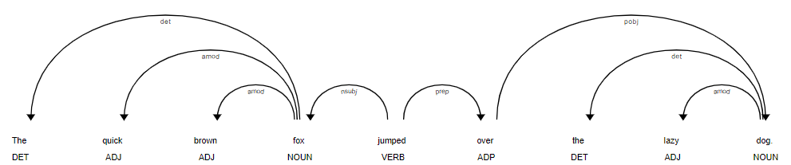

Find this repository at https://github.com/jczerwinski/comp659-as2

# Demonstration

```sh
pipenv install
pipenv shell
python -m spacy download en_core_web_sm
py main.py
```

1/2. Syntax Parsing/Dependency parsing

https://realpython.com/natural-language-processing-spacy-python/#dependency-parsing-using-spacy

Using spaCy to parse the sentence "The quick brown fox jumped over the lazy dog." gives the following parse tree:

```
The DT fox det        
quick JJ fox amod     
brown JJ fox amod     
fox NN jumped nsubj   
jumped VBD jumped ROOT
over IN jumped prep   
the DT dog det        
lazy JJ dog amod
dog NN over pobj
. . jumped punct
```



This parsing implies that the following sentence is a valid simplification of the original:

  "Fox jumped over dog."

with "The quick brown" modifying "fox", and "the lazy" modifying "dog".

3. Text Classification

For this exercise, we use NLTK's Naive Bayes Classifier with the last letter of a given name as the sole feature used for predicting the gender of a set of names.

The classifier is 75.6% accurate at identifying the gender of names in the test set. The most informative features (last letters) are as follows:

 - last_letter = 'k'              male : female =     43.2 : 1.0
 - last_letter = 'a'            female : male   =     38.3 : 1.0
 - last_letter = 'v'              male : female =     16.4 : 1.0
 - last_letter = 'f'              male : female =     16.0 : 1.0
 - last_letter = 'p'              male : female =     12.6 : 1.0
 - last_letter = 'd'              male : female =     10.1 : 1.0
 - last_letter = 'm'              male : female =     10.0 : 1.0
 - last_letter = 'o'              male : female =      8.0 : 1.0
 - last_letter = 'w'              male : female =      6.6 : 1.0
 - last_letter = 'r'              male : female =      6.5 : 1.0

4. MaxEnt

For this exercise, we simply use NLTK's Maximum Entropy classifier on the Text Classification task in exercise 3 above:

This classifier had a slightly higher accuracy than the Naive Bayes classifier at 78%. The most informative features given were similar, as follows:

 - last_letter = 'k'              male : female =     46.3 : 1.0
 - last_letter = 'a'            female : male   =     37.1 : 1.0
 - last_letter = 'p'              male : female =     19.7 : 1.0
 - last_letter = 'f'              male : female =     16.6 : 1.0
 - last_letter = 'v'              male : female =      9.8 : 1.0
 - last_letter = 'd'              male : female =      9.4 : 1.0
 - last_letter = 'o'              male : female =      8.3 : 1.0
 - last_letter = 'm'              male : female =      7.9 : 1.0
 - last_letter = 'r'              male : female =      7.1 : 1.0
 - last_letter = 'z'              male : female =      5.6 : 1.0

5. Stemming

We use NLTK's Snowball Stemmer to stem Jane Austin's Sense and Sensibility. The first few words of output from this process are as follows:

- general is the stem of general
- good is the stem of good
- opinion is the stem of opinion
- of is the stem of of
- their is the stem of their
- surround is the stem of surrounding
- acquaint is the stem of acquaintance
- . is the stem of .
- the is the stem of The
- late is the stem of late
- owner is the stem of owner
- of is the stem of of
- this is the stem of this
- estat is the stem of estate
- was is the stem of was
- a is the stem of a
- singl is the stem of single
- man is the stem of man
- , is the stem of ,
- who is the stem of who

# Paper Reading

Because my project in this course will be an n-gram text analytics system based on [Google's Ngram Viewer](https://books.google.com/ngrams), and I already assessed the paper supporting that project in assignment 1, I will simply repeat that assessment here.

## Paper Citation

Jean-Baptiste Michel, Yuan Kui Shen, Aviva Presser Aiden, Adrian Veres, Matthew K. Gray, The Google Books Team, Joseph P. Pickett, Dale Hoiberg, Dan Clancy, Peter Norvig, Jon Orwant, Steven Pinker, Martin A. Nowak, and Erez Lieberman Aiden. 2011. Quantitative Analysis of Culture Using Millions of Digitized Books. Science, 331(6014):176–182, January.

## Abstract

We constructed a corpus of digitized texts containing about 4% of all books ever printed. Analysis of this corpus enables us to investigate cultural trends quantitatively. We survey the vast terrain of ‘culturomics,’ focusing on linguistic and cultural phenomena that were reflected in the English language between 1800 and 2000. We show how this approach can provide insights about fields as diverse as lexicography, the evolution of grammar, collective memory, the adoption of technology, the pursuit of fame, censorship, and historical epidemiology. Culturomics extends the boundaries of rigorous quantitative inquiry to a wide array of new phenomena spanning the social sciences and the humanities.

## A list of highlights of the contributions of the paper

 - The study uses n-gram frequency over time to illustrate the evolution of language
 - The paper estimates the size of the english lexicon over time, and shows that it has been growing rapidly in recent years.
 - The paper quantitatively demonstrates the evolution of english grammar. For example, it quantitatively illustrates the shift from “smelt” to “smelled”
 - The paper demonstrates how cultural memories are forgotten via a decrease in frequency of their n-grams
 - The paper demonstrates the impact of censorship on term use frequency

## Methodology, results, and future work presented in the paper

## Your evaluation (or review) of the paper

This paper highlights an interesting application of n-gram based language models. The most interesting part of this study is how a relatively simple set of techniques applied to a large corpus of data, combined with interesting user interfaces, can lead to a broad number of interesting findings. It is also interesting to note that the core techniques used in this paper are applicable to a number of natural language corpus types besides books.

## An explanation of how the article connects with topics in the course (background, extension, etc.)

The paper -- and its related Google Ngram Viewer web application -- relates to the course via the core technique used in this paper -- building an n-gram based language model from an extremely large corpus of books.

## Any other background information needed to fully understand the paper.

n/a

## Your own ideas about how to continue, or start, your own research based on the paper. This could serve as part of your research proposal

My intention is to replicate the basic ideas behind this paper in the context of relatively higher-frequency business communications. I work as a Data Scientist at TELUS, and the core idea is to enable analysis of short-term trends in business communications between business stakeholders (eg. customers and employees) to allow for rapid identification of emergent business trends. See Part 2 - Design of this assignment submission for more details.

# Algorithm and Code Analysis

## Syntactic parsing -- [nltk.parse.chart](https://www.nltk.org/api/nltk.parse.html)

### Introduction

NLTK's chart parsing library contains a few different chart parsers. In this analysis we focus on NLTK's Bottom-Up chart parser.

At a high-level, chart parsers construct parse trees for sentences by iteratively adding edges to a "chart" (or a mathematical graph). These edges represent parses of the input sentence. The rules that are followed to add these edges comprise the strategy of the parser. For example, in a bottom-up parser, parses are generated as follows:

1. Apply the Bottom-Up Initialization rule: for each token, add the edge [w_i -> •, (i, i+1)].
2. Do the following until no more edges can be added:
  a. Apply the Bottom-up Predict Rule: for each complete edge [A → α•, (i, j)] and each production in our grammar B → Aβ, add self-loop edge [B → •Aβ, (i, i)].
  b. Apply the Fundamental Rule to combine complete and incomplete edges: If the chart contains the edges [A → α•Bβ, (i, j)] and [B → γ•, (j, k)] then add a new edge [A → αB•β, (i, k)]
3. Return all parse trees implied by the edges in this chart.

### Brief information about the program that implements the algorithm

NLTK's chart parsing algorithms generate sets of probable parse trees from sentences given a parsing grammar. A number of different parsing algorithms are given in the package, including a Bottom Up parser, a Top Down parser, an Earley Algorithm parser, and an A* Parser. The package is implemented in an extensible way that allows for new parsers to be implemented relatively easily. NLTK also includes a number of texts and grammars that can be utilized for testing the parsers.

### The main modules and functions of the program.

nltk.parse.chart.BottomUpChartParser is the main class of the program. It is a constructor that takes a grammar.

All BottomUpChartParser provides the parse() method, which returns an iterator over the parse trees generated by the BottomUpChartParser class.

Two other classes are relevant to this parser: FilteredBottomUpPredictCombineRule and FundamentalRule, which correspond to the Bottom-up Predict Rule and Fundamental Rule above.

### A diagram of the system architecture of the program.

![chartparser.png]

### Code Review

First, BottomUpChartParser is defined:

```python
class BottomUpChartParser(ChartParser):
    """
    A ``ChartParser`` using a bottom-up parsing strategy.
    See ``ChartParser`` for more information.
    """

    def __init__(self, grammar, **parser_args):
        if isinstance(grammar, PCFG):
            warnings.warn(
                "BottomUpChartParser only works for CFG, "
                "use BottomUpProbabilisticChartParser instead",
                category=DeprecationWarning,
            )
        ChartParser.__init__(self, grammar, BU_STRATEGY, **parser_args)
```

BU_STRATEGY represents the strategy used to execute the algorithm:

```python
BU_STRATEGY = [
    LeafInitRule(),
    EmptyPredictRule(),
    BottomUpPredictRule(),
    SingleEdgeFundamentalRule(),
```

These entries correspond to the rules outlined above; LeafInitRule and EmptyPredictRule comprise the Bottom-Up Initialization Rule, and BottomUpPredictRule and SingleEdgeFundamentalRule correspond to Bottom Up Preduct Rule and Fundamental Rule respectively.

```python
# ////////////////////////////////////////////////////////////
# Inserting Terminal Leafs
# ////////////////////////////////////////////////////////////

class LeafInitRule(AbstractChartRule):
    NUM_EDGES = 0

    def apply(self, chart, grammar):
        for index in range(chart.num_leaves()):
            new_edge = LeafEdge(chart.leaf(index), index)
            if chart.insert(new_edge, ()):
                yield new_edge
```

```python
class EmptyPredictRule(AbstractChartRule):
    """
    A rule that inserts all empty productions as passive edges,
    in every position in the chart.
    """

    NUM_EDGES = 0

    def apply(self, chart, grammar):
        for prod in grammar.productions(empty=True):
            for index in range(chart.num_leaves() + 1):
                new_edge = TreeEdge.from_production(prod, index)
                if chart.insert(new_edge, ()):
                    yield new_edge
```

```python
# ////////////////////////////////////////////////////////////
# Bottom-Up Prediction
# ////////////////////////////////////////////////////////////

class BottomUpPredictRule(AbstractChartRule):
    r"""
    A rule licensing any edge corresponding to a production whose
    right-hand side begins with a complete edge's left-hand side.  In
    particular, this rule specifies that ``[A -> alpha \*]`` licenses
    the edge ``[B -> \* A beta]`` for each grammar production ``B -> A beta``.
    """

    NUM_EDGES = 1

    def apply(self, chart, grammar, edge):
        if edge.is_incomplete():
            return
        for prod in grammar.productions(rhs=edge.lhs()):
            new_edge = TreeEdge.from_production(prod, edge.start())
            if chart.insert(new_edge, ()):
                yield new_edge
```

```python
########################################################################
##  Filtered Bottom Up
########################################################################

class FilteredSingleEdgeFundamentalRule(SingleEdgeFundamentalRule):
    def _apply_complete(self, chart, grammar, right_edge):
        end = right_edge.end()
        nexttoken = end < chart.num_leaves() and chart.leaf(end)
        for left_edge in chart.select(
            end=right_edge.start(), is_complete=False, nextsym=right_edge.lhs()
        ):
            if _bottomup_filter(grammar, nexttoken, left_edge.rhs(), left_edge.dot()):
                new_edge = left_edge.move_dot_forward(right_edge.end())
                if chart.insert_with_backpointer(new_edge, left_edge, right_edge):
                    yield new_edge

    def _apply_incomplete(self, chart, grammar, left_edge):
        for right_edge in chart.select(
            start=left_edge.end(), is_complete=True, lhs=left_edge.nextsym()
        ):
            end = right_edge.end()
            nexttoken = end < chart.num_leaves() and chart.leaf(end)
            if _bottomup_filter(grammar, nexttoken, left_edge.rhs(), left_edge.dot()):
                new_edge = left_edge.move_dot_forward(right_edge.end())
                if chart.insert_with_backpointer(new_edge, left_edge, right_edge):
                    yield new_edge
```

### Demo

This demo is adapted from https://www.nltk.org/book/ch08.html.

We use a Bottom-up parser to parse the sentence "I shot an elephant in my pajamas".

From this repository directory, run `py bottomup.py`. It should output the following parses:

(S
  (NP I)
  (VP
    (VP (V shot) (NP (Det an) (N elephant)))
    (PP (P in) (NP (Det my) (N pajamas))))) 
(S
  (NP I)
  (VP
    (V shot)
    (NP (Det an) (N elephant) (PP (P in) (NP (Det my) (N pajamas))))))

The output includes two possible parses: one where the hunter is wearing his pajamas, and another where the elephant is wearing the hunter's pajamas.

## Naive Bayes -- [nltk.classify.naivebayes](https://www.nltk.org/api/nltk.classify.html#module-nltk.classify.naivebayes)

### Introduction

The Naive Bayes algorithm is a classification algorithm that uses Bayes rule to predict the probability that a feature vector has a specific label:

![bayes1.gif]

The algorithm also assumes that features are conditionally independent of each other given the label:

![bayes2.gif]

Finally, P(features) is calculated so that the cumulative probability over all labels sums to one:

![bayes3.gif]

### Brief information about the program that implements the algorithm

NLTK's Naive Bayes classifier is implemented as part of the nltk.classify package. Because text classification is a common natural language processing task, a number of classifiers are provided as a part of this package. The package is designed in a way that makes classification for natural language tasks particularly easy. For example, indicator variables are automatically generated from textual input features.

### The main modules and functions of the program.

The `ClassifierI` interface defines the methods that concrete classifiers must (`train()`, `labels()`, `classify()` and `classify_many()`) or may (`prob_classify()` and/or `prob_classify_many()`) implement.

In this case, the Naive Bayes module is nltk.classify.naivebayes. It includes the `NaiveBayesClassifier` class, which takes two parameters:

1. The (unconditional) probability distribution of class labels.
2. The probability distribution of features conditioned on the label.

### A diagram of the system architecture of the program.

![naivebayes.png]

### Code Review

The core part of the code that implements the Naive Bayes algorithm is the `prob_classify()` method. It takes a labelled feature set as input and outputs the probability distribution of labels conditioned on features.

```python
def prob_classify(self, featureset):
        # Discard any feature names that we've never seen before.
        # Otherwise, we'll just assign a probability of 0 to
        # everything.
        featureset = featureset.copy()
        for fname in list(featureset.keys()):
            for label in self._labels:
                if (label, fname) in self._feature_probdist:
                    break
            else:
                # print('Ignoring unseen feature %s' % fname)
                del featureset[fname]

        # Find the log probabilty of each label, given the features.
        # Start with the log probability of the label itself.
        logprob = {}
        for label in self._labels:
            logprob[label] = self._label_probdist.logprob(label)

        # Then add in the log probability of features given labels.
        for label in self._labels:
            for (fname, fval) in featureset.items():
                if (label, fname) in self._feature_probdist:
                    feature_probs = self._feature_probdist[label, fname]
                    logprob[label] += feature_probs.logprob(fval)
                else:
                    # nb: This case will never come up if the
                    # classifier was created by
                    # NaiveBayesClassifier.train().
                    logprob[label] += sum_logs([])  # = -INF.

        return DictionaryProbDist(logprob, normalize=True, log=True)
```

### Demo

I use a Naive Bayes classifier and a bag-of-words model to predict the likelihood that a given word is from a specific genre using NLTK's Brown corpus.

Run `py naivebayes.py` to run the model and show the top 100 most informative features (words) in this model:

Most Informative Features
                     Hal = 1              scienc : belles =    187.4 : 1.0
                     her = 1              romanc : govern =    186.4 : 1.0
                  didn't = 1              romanc : learne =    175.8 : 1.0
                      Af = 1              learne : belles =    157.2 : 1.0
                     She = 1              romanc : govern =    155.2 : 1.0
                     God = 1              religi : learne =    134.9 : 1.0
                       ! = 1              advent : govern =    127.2 : 1.0
                   Earth = 1              scienc : belles =    123.6 : 1.0
                  States = 1              govern : fictio =    105.2 : 1.0
                  Berlin = 1              editor : learne =     99.4 : 1.0
                    clay = 1              hobbie : learne =     97.9 : 1.0
                  fiscal = 1              govern : belles =     95.3 : 1.0
                    Jack = 1              scienc : lore   =     94.0 : 1.0
                   funny = 1               humor : belles =     93.1 : 1.0
                     tax = 1              govern : lore   =     90.7 : 1.0
                  wasn't = 1              romanc : learne =     87.5 : 1.0
                  comedy = 1               humor : learne =     81.0 : 1.0
                     You = 1              romanc : learne =     76.1 : 1.0
                    Ryan = 1              scienc : lore   =     73.7 : 1.0
             development = 1              govern : fictio =     73.3 : 1.0
                 Hanover = 1              hobbie : belles =     72.2 : 1.0
                     Act = 1              govern : lore   =     71.8 : 1.0
                  church = 1              religi : hobbie =     71.7 : 1.0
                    feed = 1              hobbie : belles =     71.1 : 1.0
                       1 = 1              govern : advent =     70.9 : 1.0
                  Christ = 1              religi : govern =     70.6 : 1.0
               Christian = 1              religi : hobbie =     70.4 : 1.0
              Khrushchev = 1              editor : belles =     70.3 : 1.0
                    Mike = 1              scienc : belles =     70.1 : 1.0
                   Sept. = 1              review : learne =     70.0 : 1.0
                    Lord = 1              religi : learne =     69.2 : 1.0
                wouldn't = 1              myster : learne =     68.9 : 1.0
                    pool = 1              hobbie : learne =     68.5 : 1.0
                  walked = 1              myster : learne =     66.8 : 1.0
                       B = 1              govern : belles =     66.7 : 1.0
                    ship = 1              scienc : govern =     66.2 : 1.0
                    site = 1              hobbie : belles =     65.2 : 1.0
                    Lady = 1              scienc : learne =     62.8 : 1.0
                     Yes = 1              scienc : learne =     62.8 : 1.0
                   State = 1              govern : romanc =     62.2 : 1.0
                  Sunday = 1                news : learne =     62.1 : 1.0
                 Winston = 1              fictio : belles =     61.5 : 1.0
                  horses = 1              advent : learne =     60.3 : 1.0
                 faculty = 1              govern : belles =     60.1 : 1.0
                   Rhode = 1              govern : hobbie =     59.9 : 1.0
                  smiled = 1              scienc : belles =     59.8 : 1.0
                    cent = 1                news : belles =     59.1 : 1.0
               newspaper = 1               humor : learne =     58.7 : 1.0
                   don't = 1              myster : govern =     58.5 : 1.0
                 musical = 1              review : news   =     58.5 : 1.0
              management = 1              govern : belles =     58.4 : 1.0
                 Roberts = 1              myster : learne =     58.3 : 1.0
                    1961 = 1              govern : lore   =     58.2 : 1.0
                 members = 1              religi : advent =     58.1 : 1.0
                     son = 1              romanc : learne =     58.0 : 1.0
                   Jesus = 1              religi : news   =     57.0 : 1.0
                   faith = 1              religi : hobbie =     56.4 : 1.0
                     sin = 1              religi : learne =     56.3 : 1.0
                 Stanley = 1              myster : learne =     56.2 : 1.0
                     gun = 1              myster : learne =     56.2 : 1.0
                     Jr. = 1                news : learne =     56.1 : 1.0
                  valley = 1              advent : learne =     55.1 : 1.0
                    Hans = 1              fictio : belles =     54.8 : 1.0
                  spirit = 1              religi : advent =     54.6 : 1.0
                 there's = 1              scienc : learne =     54.5 : 1.0
                  Watson = 1              fictio : learne =     54.0 : 1.0
             temperature = 1              learne : belles =     53.6 : 1.0
                   shall = 1              govern : myster =     53.5 : 1.0
                   rifle = 1              advent : learne =     53.3 : 1.0
                  you're = 1               humor : learne =     53.1 : 1.0
                  cattle = 1                lore : belles =     52.8 : 1.0
                   India = 1              govern : learne =     52.7 : 1.0
                  Mercer = 1              scienc : news   =     52.6 : 1.0
                   Felix = 1              myster : learne =     52.0 : 1.0
                    file = 1              govern : belles =     51.8 : 1.0
              expedition = 1              scienc : belles =     51.8 : 1.0
                 program = 1              govern : fictio =     51.8 : 1.0
                    jazz = 1              review : lore   =     51.5 : 1.0
                    mold = 1              hobbie : belles =     51.2 : 1.0
                    wine = 1                lore : learne =     51.1 : 1.0
                 Medical = 1              govern : learne =     51.0 : 1.0
                aircraft = 1              hobbie : learne =     50.8 : 1.0
                 Gabriel = 1              scienc : belles =     50.2 : 1.0
                  planet = 1              scienc : belles =     50.2 : 1.0
                    Pont = 1              govern : belles =     50.2 : 1.0
                 Tuesday = 1                news : belles =     49.9 : 1.0
                 waiting = 1              myster : learne =     49.8 : 1.0
                   teeth = 1                lore : belles =     49.7 : 1.0
                  Junior = 1              hobbie : learne =     49.3 : 1.0
                   Brown = 1              govern : belles =     48.9 : 1.0
                  Palmer = 1                news : belles =     48.8 : 1.0
              Department = 1              govern : advent =     48.5 : 1.0
                   stone = 1               humor : learne =     47.5 : 1.0
                 Chinese = 1              religi : learne =     47.1 : 1.0
                       2 = 1              govern : myster =     47.0 : 1.0
                   music = 1              review : advent =     46.7 : 1.0
                    Laos = 1                news : learne =     46.4 : 1.0
                    p.m. = 1                news : learne =     46.4 : 1.0
                vacation = 1              hobbie : learne =     46.4 : 1.0
                 curious = 1              scienc : learne =     46.1 : 1.0
